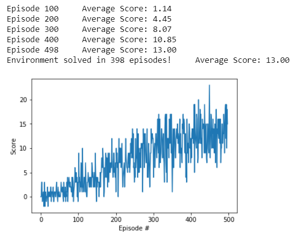

# Project report
## Learning algorithm
The learning algorithm used is Deep Q Learning. As an input the vector of state is used instead of an image so convolutional neural nework is replaced with deep neural network.

### The deep neural network architecture:
- Fully connected layer - input: state size - output: 64
- Fully connected layer - input: 64 - output 64
- Fully connected layer - input: 64 - output: action size

### Parameters used in DQN algorithm:
- Maximum steps per episode: 2000
- Starting epsilion: 1.0
- Ending epsilion: 0.01
- Epsilion decay rate: 0.995

### Conclusion:
The agent solved the task in 398 episodes and a average score of 13.00

### Ideas for future work
- Double Deep Q Networks
- Prioritized Experience Replay
- Dueling Deep Q Networks
- RAINBOW Paper
- Learning from pixels
