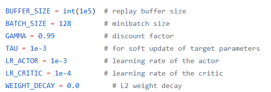

# Project report
## Learning algorithm
A Deep deterministic Policy Gradients(DDPG) algorithm was used for solving the environments of project 2 Continuous Control - Multi Agents Version

### The deep neural network architecture:
Both Actor and Critic Network were built with 256, 512 nodes in respectively two full connected layes. The batch normalization was inserted after the first hidden layer.

### Parameters used in DQN algorithm:

### Plot

### Conclusion:
The Agent solved the environment in 87 episoode with average score 30.06

### Ideas for future work
- Try Other Algorithms such as
1. Trust Region Policy Optimization (TRPO)
2. Truncated Natural Policy Gradient (TNPG)
3. Proximal Policy Optimization (PPO).
- Tune hyperparameters to find better performance and reduce training time
